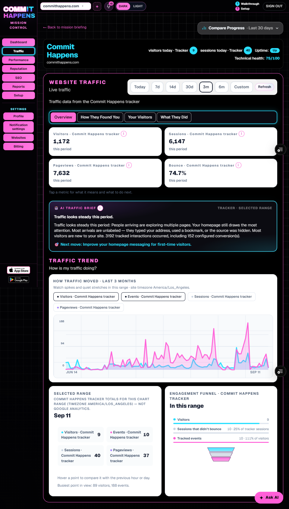
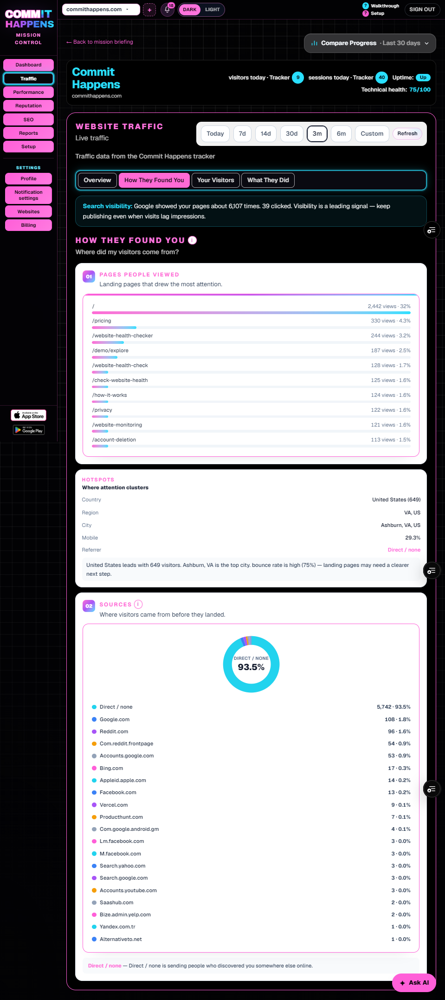
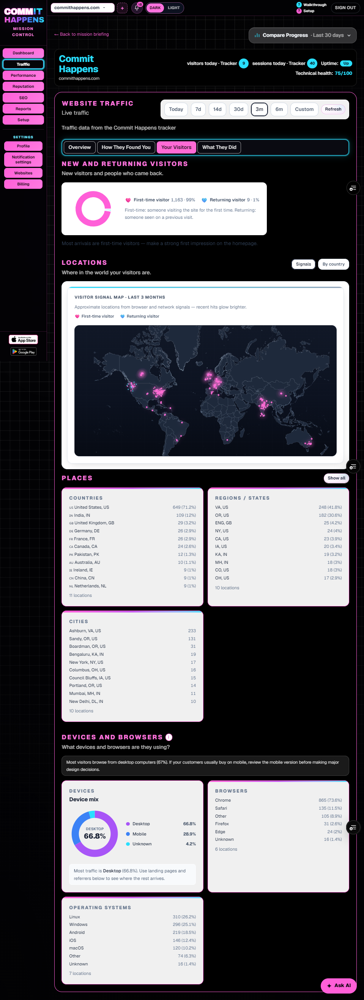
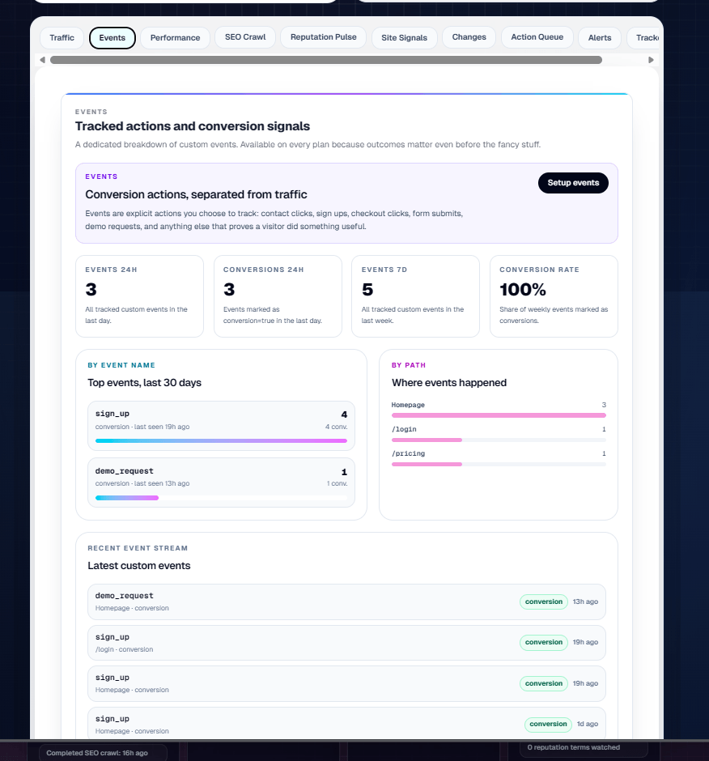
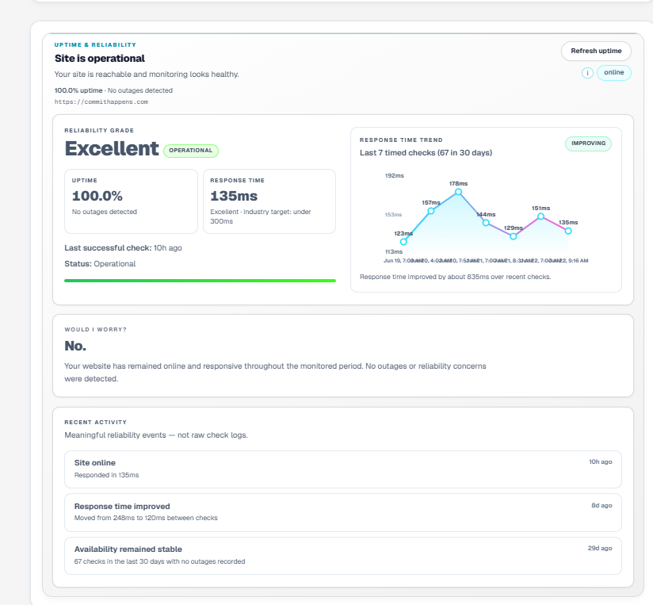

# Commit Happens

**Your Website Has Warning Lights. We Translate Them.**

> **Public engineering showcase.** I designed and shipped [Commit Happens](https://www.commithappens.com) as a live SaaS product — web, APIs, data, integrations, billing, and native iOS/Android clients. The production repository stays private.

Brand pink: `#f13a80`

---

## Engineering impact

Commit Happens is website-health software for operators who do not want six disconnected tools. One authenticated workspace (Mission Control) combines traffic, technical findings, search visibility, uptime, reputation, and guided next steps.

I built and shipped the production system behind that product:

- **Modern full-stack web application** with authenticated APIs and a multi-site operator workspace
- **Relational data layer with tenant isolation** so one account’s sites stay separated from another’s
- **Identity that works on web and mobile** — one account, consistent ownership
- **First-party analytics** plus optional **Google Analytics** and **Google Search Console** as product features
- **Asynchronous technical analysis** that turns site findings into operator-facing results
- **Subscriptions that work across web and mobile**
- **Distributed abuse protection** on sensitive public and authenticated paths
- **Native iOS and Android clients** on the [App Store](https://apps.apple.com/us/app/commit-happens/id6787823394) and [Google Play](https://play.google.com/store/apps/details?id=com.commithappens.app)
- **Cloud deployment** with production observability and health checks

This is not a tutorial clone. It is a shipped product with real auth, billing, abuse controls, and store review constraints.

Implementation details, vendor topology, and internal architecture stay private.

---

## Product system

| Area | What the product does |
| --- | --- |
| Interface | Web app plus native iOS / Android clients |
| Workspace | Authenticated Mission Control for multiple sites |
| Data | Relational, owner-scoped product data |
| Analytics | First-party traffic, plus optional Google Analytics |
| Search | Optional Google Search Console signals |
| Analysis | Asynchronous technical findings in plain English |
| AI | Summaries and guided help grounded in product data |
| Access | Subscriptions that resolve to one entitlement model |
| Reliability | Abuse protection, health checks, and observability |

Internal service boundaries, job orchestration, route maps, and data flows remain private.

More detail: [`docs/architecture.md`](docs/architecture.md)

---

## Hard production problems

Problems that required production engineering — described at the outcome level, not the implementation level:

1. **Identity across clients** — one account has to behave the same on the web and on a phone.
2. **Tenant isolation** — site-scoped data is only available to the owner of that site.
3. **Integration reliability** — optional Google Analytics and Search Console connections need a clear healthy / needs-attention state.
4. **Asynchronous analysis** — long-running website analysis has to become durable product results.
5. **Guided outcomes** — findings become next actions without exposing proprietary verification logic.
6. **Cross-platform access** — subscription state stays consistent across web and store commerce.
7. **Abuse protection** — public and authenticated paths fail predictably when misused.
8. **Localization and store release** — the same product has to survive App Store and Play review.
9. **Failure visibility** — production health checks and observability cover the paths that actually break.

---

## Product decisions

| Decision | Why |
| --- | --- |
| One product surface for web and mobile | Operators get the same Mission Control instead of three frontends. |
| Relational, owner-scoped data | Website health is a graph of sites, findings, and access — not a pile of logs. |
| Identity that spans clients | Signup and recovery have to work on a laptop and on a phone. |
| Fail closed on untrusted input | Bad payloads never become stored product state. |
| Unified entitlements | Web and mobile purchases still mean the same access. |
| AI as a layer, not the product | Health signals stay deterministic; AI explains them. |

Tradeoffs: [`docs/engineering-decisions.md`](docs/engineering-decisions.md)

---

## Security posture

Principles only — no schemes, thresholds, or bypasses:

- authenticated sessions in production
- tenant isolation before site-scoped reads and writes
- secrets only in environment configuration
- secure third-party integrations (connection health in the UI, not raw credentials)
- distributed abuse protection on sensitive paths
- account deletion and store / privacy compliance paths
- observability that prefers error classes over payloads or PII

See [`docs/security.md`](docs/security.md).

---

## Screenshots

These are product UI captures of **commithappens.com** (owned demo property). No customer sites.

**Traffic — first-party sessions, pageviews, bounce, and an AI briefing**

**Acquisition — landing pages and traffic sources**

**Visitors — geography, devices, and browsers**

**SEO Intelligence and Guided Fix**

Technical findings are translated into prioritized, plain-language action. Detailed
issue taxonomies, walkthroughs, verification behavior, and full workflow captures
remain private.

**Events — conversions tracked in the same workspace**

**Uptime — availability and response time**

Native apps: [App Store](https://apps.apple.com/us/app/commit-happens/id6787823394) · [Google Play](https://play.google.com/store/apps/details?id=com.commithappens.app)

Notes: [`assets/screenshots/README.md`](assets/screenshots/README.md)

---

## Reconstructed examples

Generic portfolio snippets — **not** production source, **not** Commit Happens security architecture, and **not** a license to recreate the product.

| File | What it shows |
| --- | --- |
| [`result.ts`](examples/sanitized-code-examples/result.ts) | A small `Result` type for fail-closed parsing |
| [`format-metric.ts`](examples/sanitized-code-examples/format-metric.ts) | Display helpers for dashboard numbers |

Index: [`examples/README.md`](examples/README.md)

---

## Documentation

| Doc | Contents |
| --- | --- |
| [`docs/product-overview.md`](docs/product-overview.md) | Product surfaces |
| [`docs/architecture.md`](docs/architecture.md) | High-level product system |
| [`docs/engineering-decisions.md`](docs/engineering-decisions.md) | Product-level tradeoffs |
| [`docs/integrations.md`](docs/integrations.md) | Integrations at the product level |
| [`docs/security.md`](docs/security.md) | Security principles |

---

## Disclaimer

This repository is a **hiring / technical-review showcase**. It is documentation and reconstructed examples — not a clone-and-run app and not an open-source implementation of Commit Happens.

- Production application and source code are **proprietary**. See [`LICENSE`](LICENSE).
- Scoring formulas, prompts, raw provider payloads, customer data, operator tooling, secrets, and implementation blueprints are omitted on purpose.
- Code examples are generic reconstructed snippets, **not** production source.

---

## Links

- Product: [https://www.commithappens.com](https://www.commithappens.com)
- App Store: [Commit Happens](https://apps.apple.com/us/app/commit-happens/id6787823394)
- Google Play: [Commit Happens](https://play.google.com/store/apps/details?id=com.commithappens.app)
- Portfolio: [ashthedev.com](https://www.ashthedev.com)
- GitHub: [ash-the-dev](https://github.com/ash-the-dev)

Built by **Ash Morales** — production SaaS, web + mobile.
